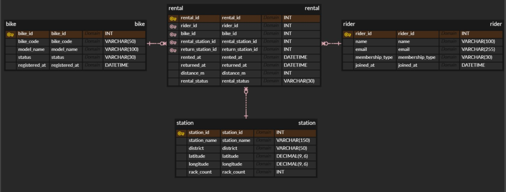

# Codyssey B6-1 — 서울시 공공자전거 따릉이 대여 관리 데이터베이스

## 개요

서울시 공공자전거 **따릉이**의 이용자, 자전거, 대여소, 대여 기록을 관계형 데이터베이스로 관리하는 실습 프로젝트이다.

이 프로젝트에서는 데이터를 하나의 표에 모두 저장하지 않고, `rider`, `bike`, `station`, `rental`의 4개 테이블로 분리하여 관계를 표현한다.  
이를 통해 PK/FK, 1:N 관계, JOIN, GROUP BY, 서브쿼리, UPDATE/DELETE, INDEX의 기본 사용법을 학습한다.

---

# 1. 개발 환경

| 구분          | 사용 환경                     |
| ------------- | ----------------------------- |
| OS            | Windows 10                    |
| DBMS          | MySQL 8.0.39 Community Server |
| DB Host       | `127.0.0.1`                   |
| DB Port       | `3306`                        |
| Database      | `codyssey_db`                 |
| SQL 실행 도구 | MySQL CLI                     |
| GUI 도구      | DBeaver                       |
| 문자 인코딩   | `utf8mb4`                     |
| 정렬 규칙     | `utf8mb4_unicode_ci`          |

MySQL CLI는 한글 SQL 파일을 정상적으로 읽기 위해 `utf8mb4` 문자셋으로 실행한다.

```powershell
& "C:\Program Files\MySQL\MySQL Server 8.0\bin\mysql.exe" `
  --default-character-set=utf8mb4 `
  -u root -p
```

---

# 2. 실행 방법

## 2.1 전체 실행 순서

MySQL CLI에 접속한 뒤 아래 순서로 실행한다.

```sql
SOURCE C:/Users/kwonu/Desktop/codyssey/codyssey-b6-1/sql/01_schema.sql;
SOURCE C:/Users/kwonu/Desktop/codyssey/codyssey-b6-1/sql/02_seed.sql;
SOURCE C:/Users/kwonu/Desktop/codyssey/codyssey-b6-1/sql/03_queries.sql;
```

각 파일의 역할은 다음과 같다.

```text
01_schema.sql
    ↓
데이터베이스 및 테이블 생성

02_seed.sql
    ↓
샘플 데이터 입력

03_queries.sql
    ↓
15개 핵심 SQL 실행
    ↓
tee를 사용하여 실행 결과를 txt 파일로 저장
```

## 2.2 `tee`를 이용한 실행 결과 저장

MySQL CLI의 `tee` 명령을 사용하면 터미널에 출력되는 실행 결과를 텍스트 파일로 저장할 수 있다.

예:

```text
tee C:/Users/kwonu/Desktop/codyssey/codyssey-b6-1/results/query_01.txt
```

그 후 SQL을 실행한다.

```sql
SELECT
    station_id,
    station_name,
    district,
    rack_count
FROM station
WHERE district = '마포구';
```

저장을 종료할 때는 다음 명령을 사용한다.

```text
notee
```

따라서 실행 흐름은 다음과 같다.

```text
tee 결과파일경로
        ↓
SQL 실행
        ↓
실행 결과가 화면 + txt 파일에 기록
        ↓
notee
```

`03_queries.sql`에서는 이 방식을 사용해 `query_01.txt`부터 `query_15.txt`까지 저장한다.

---

# 3. 테이블 구조

## 3.1 주제

**서울시 공공자전거 따릉이 대여 관리 데이터베이스**

따릉이 서비스의 다음 정보를 관리한다.

- 이용자
- 자전거
- 대여소
- 대여 및 반납 기록

`rental` 테이블을 중심으로 나머지 세 테이블이 연결되는 구조이다.

## 3.2 테이블 구성

| 테이블    | 설명                   | 주요 컬럼                                                                                                                               |
| --------- | ---------------------- | --------------------------------------------------------------------------------------------------------------------------------------- |
| `rider`   | 따릉이 이용자 정보     | `rider_id`, `name`, `email`, `membership_type`, `joined_at`                                                                             |
| `bike`    | 따릉이 자전거 정보     | `bike_id`, `bike_code`, `model_name`, `status`, `registered_at`                                                                         |
| `station` | 따릉이 대여소 정보     | `station_id`, `station_name`, `district`, `latitude`, `longitude`, `rack_count`                                                         |
| `rental`  | 실제 대여 및 반납 기록 | `rental_id`, `rider_id`, `bike_id`, `rental_station_id`, `return_station_id`, `rented_at`, `returned_at`, `distance_m`, `rental_status` |

## 3.3 1:N 관계

```text
rider    ──< rental
이용자 1 : 대여기록 N

bike     ──< rental
자전거 1 : 대여기록 N

station  ──< rental
대여소 1 : 출발 대여기록 N

station  ──< rental
대여소 1 : 반납 대여기록 N
```

한 이용자는 여러 번 따릉이를 이용할 수 있으며, 한 자전거 역시 여러 번 대여될 수 있다.

`station` 테이블은 `rental` 테이블에서 두 번 참조된다.

```text
rental.rental_station_id
        ↓
station.station_id
        = 자전거를 빌린 장소

rental.return_station_id
        ↓
station.station_id
        = 자전거를 반납한 장소
```

---

# 4. ERD

전체 테이블 관계는 다음 ERD에서 확인할 수 있다.



---

# 5. 제약조건

데이터의 무결성을 유지하기 위해 PK, FK, NOT NULL, UNIQUE 등의 제약조건을 적용하였다.

| 제약조건         | 적용 컬럼                                        | 적용 이유                          |
| ---------------- | ------------------------------------------------ | ---------------------------------- |
| `PRIMARY KEY`    | 각 테이블의 `*_id`                               | 각 행을 유일하게 식별              |
| `AUTO_INCREMENT` | `rider_id`, `bike_id`, `station_id`, `rental_id` | 새로운 데이터 입력 시 ID 자동 생성 |
| `NOT NULL`       | `rider.name`                                     | 이름이 없는 이용자 방지            |
| `NOT NULL`       | `rider.email`                                    | 이메일 없는 이용자 방지            |
| `NOT NULL`       | `rider.membership_type`                          | 회원 유형 필수                     |
| `NOT NULL`       | `bike.bike_code`                                 | 자전거 식별 코드 필수              |
| `NOT NULL`       | `bike.status`                                    | 자전거 상태 필수                   |
| `NOT NULL`       | `station.station_name`                           | 대여소 이름 필수                   |
| `NOT NULL`       | `station.district`                               | 자치구 정보 필수                   |
| `NOT NULL`       | `rental.rider_id`                                | 대여자를 반드시 식별               |
| `NOT NULL`       | `rental.bike_id`                                 | 대여 자전거를 반드시 식별          |
| `NOT NULL`       | `rental.rental_station_id`                       | 출발 대여소 필수                   |
| `NOT NULL`       | `rental.rented_at`                               | 대여 시작 시각 필수                |
| `NOT NULL`       | `rental.rental_status`                           | 대여 상태 필수                     |
| `UNIQUE`         | `rider.email`                                    | 동일 이메일 중복 방지              |
| `UNIQUE`         | `bike.bike_code`                                 | 동일 자전거 코드 중복 방지         |
| `FOREIGN KEY`    | `rental.rider_id`                                | 존재하는 이용자만 참조             |
| `FOREIGN KEY`    | `rental.bike_id`                                 | 존재하는 자전거만 참조             |
| `FOREIGN KEY`    | `rental.rental_station_id`                       | 존재하는 대여소만 출발지로 사용    |
| `FOREIGN KEY`    | `rental.return_station_id`                       | 존재하는 대여소만 반납지로 사용    |

`return_station_id`, `returned_at`, `distance_m`은 아직 반납되지 않은 대여를 표현하기 위해 `NULL`을 허용한다.

---

# 6. 제출 파일 구성

```text
codyssey-b6-1/
│
├── README.md
│
├── sql/
│   ├── 01_schema.sql
│   ├── 02_seed.sql
│   └── 03_queries.sql
│
├── results/
│   ├── query_01.txt
│   ├── query_02.txt
│   ├── query_03.txt
│   ├── query_04.txt
│   ├── query_05.txt
│   ├── query_06.txt
│   ├── query_07.txt
│   ├── query_08.txt
│   ├── query_09.txt
│   ├── query_10.txt
│   ├── query_11.txt
│   ├── query_12.txt
│   ├── query_13.txt
│   ├── query_14.txt
│   └── query_15.txt
│
└── img/
    └── erd.JPG
```

---

# 7. 핵심 쿼리

## 7.1 기본 조회

| 번호 | 설명                                            | 주요 SQL 절                  |
| ---- | ----------------------------------------------- | ---------------------------- |
| Q1   | 마포구에 위치한 대여소 조회                     | `SELECT`, `WHERE`            |
| Q2   | 이동거리 5km 이상이면서 대여가 완료된 기록 조회 | `SELECT`, `WHERE`, `AND`     |
| Q3   | 최근 대여 기록부터 조회                         | `SELECT`, `ORDER BY DESC`    |
| Q4   | 이동거리가 가장 긴 대여 기록 5개 조회           | `WHERE`, `ORDER BY`, `LIMIT` |

Q1에서는 `district = '마포구'` 조건으로 홍대입구역과 합정역 대여소가 조회된다.

Q2에서는 `distance_m >= 5000`과 `completed` 조건을 동시에 만족하는 6건이 조회된다.

Q3은 `rented_at DESC`를 사용하여 최신 대여 기록부터 정렬한다.

Q4는 이동거리를 내림차순으로 정렬한 뒤 `LIMIT 5`를 사용한다.

## 7.2 JOIN

| 번호 | 설명                                                | 주요 SQL 절                      |
| ---- | --------------------------------------------------- | -------------------------------- |
| Q5   | 대여 기록에 이용자 이름 결합                        | `INNER JOIN`, `ON`               |
| Q6   | 대여 기록에 자전거 코드 및 모델 결합                | `INNER JOIN`, `ON`               |
| Q7   | 대여소와 반납 대여소 이름을 동시에 조회             | `INNER JOIN`, `LEFT JOIN`        |
| Q8   | 대여 기록이 없는 이용자까지 포함하여 이용 횟수 계산 | `LEFT JOIN`, `GROUP BY`, `COUNT` |

Q5는 `rental.rider_id`와 `rider.rider_id`를 연결하여 대여 기록에 이용자 이름을 추가한다.

Q6는 `bike_id`를 기준으로 자전거 코드와 모델 정보를 결합한다.

Q7에서는 출발 대여소는 반드시 존재하므로 `INNER JOIN`을 사용하고, 아직 반납되지 않은 데이터도 유지하기 위해 반납 대여소에는 `LEFT JOIN`을 사용한다. 실제 결과에서도 대여 기록 15번의 반납 대여소와 반납 시간이 `NULL`로 유지된다.

Q8은 `rider`를 기준으로 `LEFT JOIN`하여 대여 기록이 없는 이용자도 결과에 유지할 수 있는 구조이다.

## 7.3 GROUP BY 및 집계

| 번호 | 설명                                     | 주요 SQL 절                       |
| ---- | ---------------------------------------- | --------------------------------- |
| Q9   | 실제 대여 기록이 있는 이용자별 이용 횟수 | `INNER JOIN`, `GROUP BY`, `COUNT` |
| Q10  | 자전거별 누적 이동거리                   | `GROUP BY`, `SUM`                 |
| Q11  | 대여소별 평균 이동거리                   | `GROUP BY`, `AVG`                 |

Q9는 같은 이용자 ID를 하나의 그룹으로 묶어 대여 횟수를 계산한다.

Q10은 자전거별로 대여 기록을 그룹화한 뒤 `SUM(distance_m)`으로 총 이동거리를 계산한다.

Q11은 출발 대여소별로 데이터를 묶은 뒤 `AVG(distance_m)`으로 평균 이동거리를 구한다.

## 7.4 서브쿼리

| 번호 | 설명                                     | 주요 SQL 절                         |
| ---- | ---------------------------------------- | ----------------------------------- |
| Q12  | 전체 평균 이동거리보다 긴 대여 기록 조회 | `WHERE`, `SELECT AVG(...)` 서브쿼리 |

Q12에서는 내부 쿼리가 전체 평균 이동거리를 먼저 계산하고, 외부 쿼리가 그 값보다 이동거리가 큰 기록만 선택한다.

## 7.5 데이터 수정 및 삭제

| 번호 | 설명                                | 주요 SQL 절                  |
| ---- | ----------------------------------- | ---------------------------- |
| Q13  | 특정 자전거 상태를 정비 중으로 변경 | `UPDATE`, `SET`, `WHERE`     |
| Q14  | 반납되지 않은 테스트 대여 기록 삭제 | `DELETE`, `WHERE`, `IS NULL` |

Q13에서는 `SEOUL-BIKE-010`의 상태가 `available`에서 `maintenance`로 변경되는 것을 전후 조회로 확인한다.

Q14는 `rented` 상태이면서 반납 대여소가 없는 대여 기록을 삭제한다. 삭제 전에는 1건이 존재하고 삭제 후에는 결과가 비어 있음을 확인할 수 있다.

## 7.6 인덱스

| 번호 | 설명                                | 주요 SQL 절                  |
| ---- | ----------------------------------- | ---------------------------- |
| Q15  | 대여 시각 컬럼에 검색용 인덱스 생성 | `CREATE INDEX`, `SHOW INDEX` |

Q15에서는 `rental.rented_at`에 `idx_rental_rented_at` 인덱스를 생성한다. MySQL 실행 결과에서 인덱스 타입이 `BTREE`로 생성된 것을 확인할 수 있다.

---

# 8. 주요 설계 결정

### Q1. 왜 하나의 큰 테이블이 아니라 4개의 테이블로 분리했는가?

**A.** 이용자, 자전거, 대여소처럼 반복되는 정보를 한 번만 저장하고 대여 기록에서는 ID로 참조하기 위해 분리했다. 이를 통해 데이터 중복을 줄이고 FK를 이용해 관계의 무결성을 유지할 수 있다.

### Q2. 왜 `return_station_id`, `returned_at`, `distance_m`은 NULL을 허용했는가?

**A.** 사용자가 아직 자전거를 이용 중이라면 반납 장소, 반납 시각, 최종 이동거리가 아직 결정되지 않았기 때문이다. 따라서 대여 중인 상태 자체를 데이터베이스에서 자연스럽게 표현할 수 있도록 NULL을 허용했다.

### Q3. 왜 `rented_at` 컬럼에 인덱스를 생성했는가?

**A.** 실제 서비스에서는 대여 기록이 지속적으로 누적되며 기간 검색이나 최근 대여 기록 조회가 자주 발생할 수 있다. 따라서 대여 시각을 기준으로 데이터를 빠르게 탐색할 수 있도록 인덱스를 추가했다.


